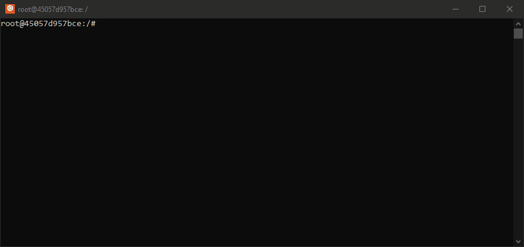
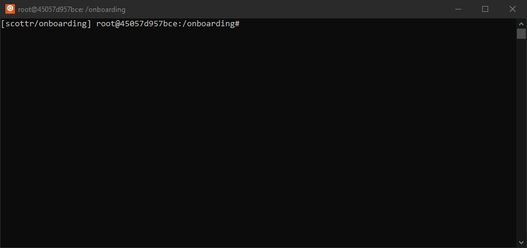

# Managing your team depedencies

Ever try diving into someone elses software development project and get frustrated about what it takes to setup a development enviroment? Often the instructions are vague, don't cover your specific setup, are out of date or completely missing!
   

This simple project demonstrates how you can streamline setting up development environments for members of your team.

With the ActiveState platform, you can setup all the dependecies needed to run and develop your project regardless
of operating system and reduce complicated development enivronment setup down to single command.

In our hypothetical python project, we've setup a simple unit test that ensure's you're using the right version of Python. On the
main branch, which simulates your current production release, we require Python 3.9. There is also a branch where we're working on
a new feature that requires you to upgrade to Python 3.10, aplty named awesome-new-feature.

It does not matter whether you have Python installed or or if you have the wrong version of Python. The ActiveState platform
will ensure you have the right right depdencies for the given git commit you're working on.


## Bootstraping your environment

To try this simply run the appropriate shell command based on your operating system. 

It will: 
* Install the *state tool*, our package manager for teams, if it not already present on the machine.
* Checkout this git repository (Git not required!)
* Configure git hooks
* Install your needed depdencies


###  Linux and Mac, run this command 

Assuming you have curl installed on your machine this single command is all you need
to get setup to code:

```bash
$ sh <(curl -q https://platform.activestate.com/dl/cli/655424048.1642518345_pdli01/install.sh) -c'state activate --default ActiveState/onboarding'
```




### Windows users, run this command

```powershell

c:\> powershell -Command "& $([scriptblock]::Create((New-Object Net.WebClient).DownloadString('https://platform.activestate.com/dl/cli/655424048.1642518345_pdli01/install.ps1'))) -c'state activate --default ActiveState/onboarding'"

```

### If state tool is already istalled

If you are the type that does not like to run random content through your shell process 
OR you have already installed another project on your system then you can directly activate the virtual enviorment by typing the following command:

`state activate ActiveState/onboarding`


**TODO: Insert instructions or links to installing the state tool directly**

## Running the unit tests 

Once installations is finished, you can run the unit tests.. we've set up a simple entrypoint in the activestate.yaml called  `testit` that invokes pytest for you.




Note from the output, it's using Python 3.9.15.

## See dynamic enviorment provisioning in work

Now, let's try the other branch which requires Python 3.10. It couldn't be eaiser
just checkout the github branch and run `testit` again.


That's it! Thanks to the git hook and state tool, whenever you change branches or pull in new commits from a remote repo we ensure all your dedpdencies are up to date. And we mean, ALL YOUR DEPEDENCIES, which  includes compliers, interpteres, c-libraries and other devtools are up to date.


