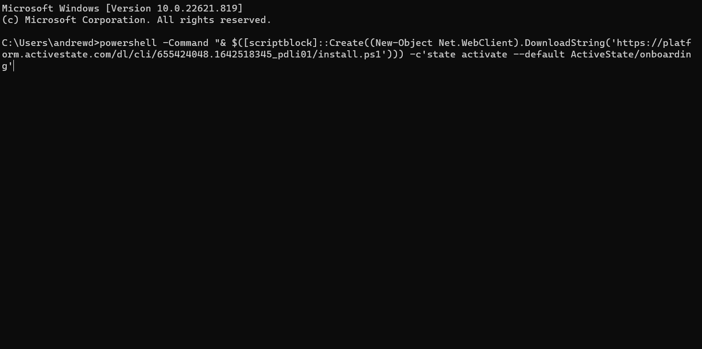

# Managing your team dependencies

Have you ever tried diving into someone else's software development project and got frustrated about what it takes to set up a development environment? Often the instructions are vague, don't cover your specific setup, are out of date, or are completely missing!

This simple project demonstrates how you can streamline setting up development environments for your team members.

With the ActiveState platform, you can set up all the dependencies needed to run and develop your project regardless of operating system, and reduce a complicated development environment setup down to single command.

In our hypothetical Python project, we've set up a simple unit test that ensures you're using the right version of Python. On the main branch, which simulates your current production release, we require Python 3.9. There is also a branch where we're working on a new feature that requires you to upgrade to Python 3.10, aptly named “awesome-new-feature”.

It doesn't matter whether you have Python installed or if you have the wrong version of Python. The ActiveState platform will ensure you have the right dependencies for the given git commit you're working on.


## **Bootstrapping your environment**

To try this, simply run the appropriate shell command based on your operating system.

Doing so will:


* Install the State Tool, our package manager for teams, if it is not already present on the machine.
* Checkout this git repository (git is not required!)
* Configure git hooks
* Install your needed dependencies

### **Linux and Mac**


### 
Assuming you have curl installed on your machine this single command is all you need to get set up to code:


```
sh <(curl -q https://platform.activestate.com/dl/cli/655424048.1642518345_pdli01/install.sh) -c'state activate --default ActiveState/onboarding'
```


### **Windows** 


```


powershell -Command "& $([scriptblock]::Create((New-Object Net.WebClient).DownloadString('https://platform.activestate.com/dl/cli/655424048.1642518345_pdli01/install.ps1'))) -c'state activate --default ActiveState/onboarding'"
```




### **If the State Tool is already installed**

If you are the type that doesn’t like to run random content through your shell process OR you have already installed another project on your system, you can directly activate the virtual environment by typing the following command:


```
state activate ActiveState/onboarding

```
 [See instructions](https://docs.activestate.com/platform/state/install/#installing-on-windows) for installing State Tool independent of project activation.


## Running the unit tests

Once the installation has finished, you can run the unit tests. We've set up a simple entry point in the activestate.yaml called `testit` that invokes pytest for you.


Note from the output, it's using Python 3.9.15.


## **See dynamic environment provisioning at work**

Now, let's try the other branch which requires Python 3.10. It couldn't be easier just checkout the GitHub branch and run `testit` again.


That's it! Thanks to the git hook and State Tool, whenever you change branches or pull in new commits from a remote repo we ensure all your dependencies are up to date. And we mean, ALL YOUR DEPENDENCIES, which include: compilers, interpreters, c-libraries, and other devtools are up to date.
